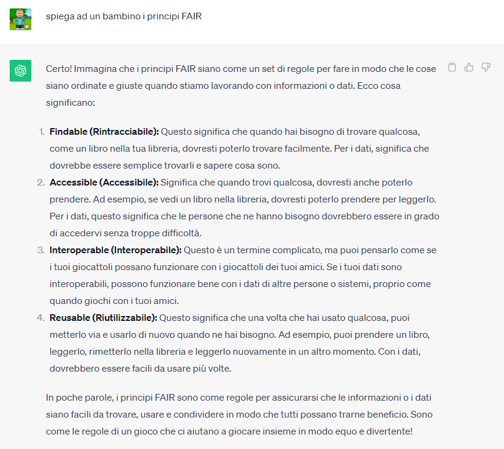
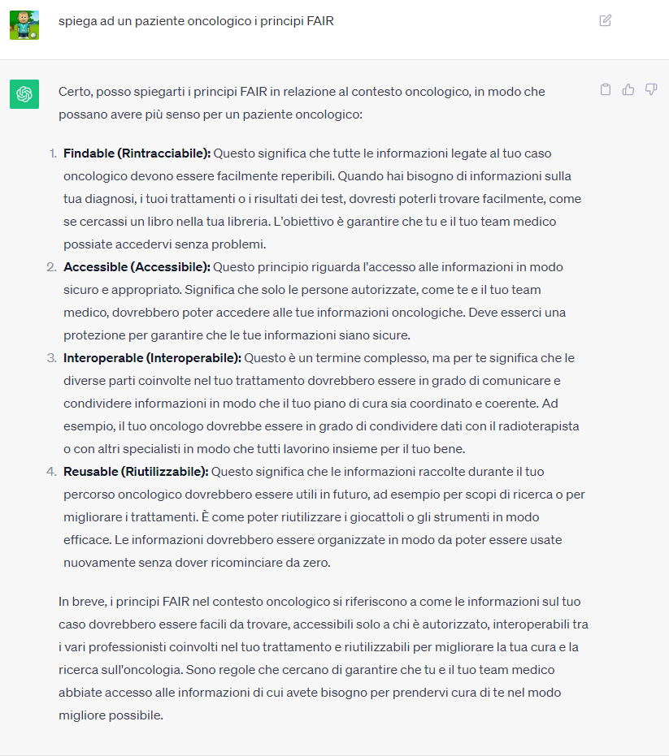

## Sfide e opportunità dell'Intelligenza Artificiale in Sanità

*Settimana del buon vivere. Chiesa di San Giacomo, Forlì.*
*25 Settembre 2023*

**Intervento a cura della Data Unit IRST (dataunit@irst.emr.it)**

## Come si addestra un sistema di Intelligenza Artificiale in Sanità?

Prima di tutto è necessario comprendere che in generale l'intelligenza artificiale può essere realizzate per **diversi
obiettivi**:
riconoscere, interpretare, classificare, raggruppare, estrarre conoscenza (caratteristiche e regole), inferire
conoscenza.
Inoltre è importante sapere che esistono sistemi informatici tradizionali che spesso sono più efficaci delle AI,
soprattutto per affrontare problemi più semplici o già bene strutturati.

Per rispondere sinteticamente alla domanda come si addestra un sistema di Intelligenza Artificiale in Sanità? possiamo
elencare alcune azioni rilevanti.

### 1. Definire l'obiettivo prima dei dati

- Possiamo chiedere all'AI di supportare un processo organizzativo, clinico, di ricerca, di comunicazione, ...
- Per quanto riguarda la clinica alcuni esempio: gestione della sicurezza e prevenzione dei rischi, promozione degli
  stili di vita e prevenzione, analisi delle immagini mediche, gestione della salute mentale, diagnosi, assistenti
  virtuali, interpretazione dati da dispositivi indossabili.
- Nel settore farmaceutico l'intero processo di progettazione e sviluppo dei farmaci alla progettazione, marketing,
  supporto.

### 2. Custodire il processo di preparazione dei dati:

- Di solito questo costituisce almeno l'80% del lavoro.
- Servono grandi quantità di dati, di esempi (sempre più grandi quanto più complesso è il problema) e servono dati
  di qualità.
- La letteratura scientifica e le politiche europee suggeriscono il rispetto dei principi FAIR (Findable,
  Accessible, Interoperable, Reusable).

    Esempio di FAIR: il caso Moderna durante il Covid-19
    1. All'inizio della seconda settimana di Gennaio 2020, alcuni ricercatori cinesi a Wuhan hanno annunciato di aver isolato e sequenziato l'intero virus.
    2. L'11 Gennaio, il DNA sequenziato è stato pubblicato su virological.org
    3. Due giorni dopo, il 13 Gennaio, l'Azienda Farmaceutica Moderna aveva completato la progettazione di un vaccino candidato per il virus.
    4. Il 7 febbraio è stata avviata la fase 1
    5. Il 24 febbraio sono stati completati i test di controllo di qualità. Il vaccino è stato inviato al National Instite of Health per la preparazione dei test preliminari (Trial clinici di fase 1) su alcuni volontari di Seattle, Washington.
    Stéphan Bancel, CEO di Moderna, ha dichiarato: "Abbiamo fatto tutto questo iun due mesi. Fino ad oggi, chi aveva impiegato meno tempo per queste attività, aveva speso 20 mesi, per la SARS. Una riduzione di tempo del 90%'
    
    Iansiti M, Lakhani K, Mayer H, Herman K. Moderna (A). Harvard Business School case report 9-621-032. July 13, 2021.

    I principi FAIR hanno giocato il loro ruolo in questa vicenda.

### 3. Aderire alla regolamentazione sull'Intelligenza Artificiale e applicare misure di sicurezza e rispetto della privacy

1. Artificial Intelligence Act: L'Unione Europea ha introdotto il "AI Act", la prima regolamentazione completa al
   mondo sull'intelligenza artificiale, al fine di garantire lo sviluppo e l'uso responsabile dell'intelligenza
   artificiale in vari settori, compreso il settore sanitario. L'AI Act classifica i sistemi di decisione automatica in
   base al rischio per gli utenti e definisce i requisiti da rispettare per il loro sviluppo.

       L'AI Act mira a:
        - Classificare e Regolamentare i Sistemi di Intelligenza Artificiale: I sistemi di intelligenza
          artificiale vengono analizzati e classificati in base al rischio che comportano per gli utenti. Il provvedimento
          introduce tre principali categorie: pratiche vietate, sistemi ad alto rischio e altri sistemi di intelligenza
          artificiale. Questa classificazione determina il livello di regolamentazione per ciascun tipo di applicazione di
          intelligenza artificiale.
        - Proteggere i Diritti Umani e la Sicurezza: Il "AI Act" include disposizioni per proteggere i diritti fondamentali,
          come la privacy e la non discriminazione, e per garantire la sicurezza e la trasparenza dei sistemi di
          intelligenza artificiale.
        - Istituire un Consiglio Europeo per l'Intelligenza Artificiale: Il provvedimento propone la creazione di un
          Consiglio Europeo per l'Intelligenza Artificiale al fine di promuovere la cooperazione nazionale e garantire il
          rispetto del regolamento.
        - Influenzare gli Standard Globali sull'Intelligenza Artificiale: Similmente al Regolamento Generale sulla
          Protezione dei Dati (GDPR) dell'Unione Europea, il "AI Act" ha il potenziale per diventare uno standard globale
          per la regolamentazione dell'intelligenza artificiale. Il suo impatto si fa già sentire al di fuori dell'Europa,
          con paesi come il Brasile che approvano leggi sull'intelligenza artificiale ispirate all'approccio dell'UE.
    
       Nel contesto sanitario, l'AI Act mira a garantire l'uso responsabile dei sistemi di intelligenza artificiale
       per la diagnosi medica, la pianificazione dei trattamenti, il monitoraggio dei pazienti e altre applicazioni.
       Fornendo un chiaro quadro normativo, il provvedimento cerca di promuovere lo sviluppo di soluzioni di intelligenza
       artificiale affidabili e orientate all'essere umano che apportino benefici ai pazienti e agli operatori sanitari.
       Rispetto della privacy: sviluppo di nuove soluzioni, tra cui il "Privacy Budget", l'anonimizzazione, il "Federated
       Learning" (con attenzione ai nuovi tipi di attacchi) e l'uso di dati sintetici.

- Nuove soluzioni per supportare il rispetto della privacy
    - Anonimizzazione dei dati
    - Privacy Budget
    - Federated Learning (Attenzione: nuovi tipi di attacchi)
    - Uso di dati sintetici per l'addestramento

### 4. Formazione e cultura

- Il processo di addestramento di un'AI in ambito sanitario inizia con la formazione di tutte le persone coinvolte nei
  processi all'interno dei quali si voglio applicare le soluzioni da sviluppare.
- Esistono almeno due ambiti:
    - formazione specifica su metodi, strumenti, opportunità e rischi;
    - creazione di una cultura generale sull'Intelligenza Artificiale (coinvolgente diverse discipline, non solo aspetti
      tecnologici).

### 5. Collaborazione multidisciplinare

L'intero processo richiede la collaborazione di informatici, medici, pazienti, infermieri, ricercatori, enti e
università.

### 6. Iniziative IRST

- Progetti FLUTE e Trumpet.
- Data Unit e MML Late Night.
- Sondaggio rivolto ai pazienti.

---

## Bias, pregiudizi, stereotipi: l'Intelligenza Artificiale come specchio

L'Intelligenza Artificiale (AI) è una sorta di chiave di volta, un punto di convergenza di molte discipline (
matematica, informatica, cybersecurity, legge, medicina, chimica, fisica, scienze ambientali, scienze del linguaggio e i
nuovi modelli generativi stanno dimostrando tutto ciò, fino all'etica e alla filosofia.

I modelli generativi sono estremamente complessi e articolati. Per semplificare notevolmente e tralasciare tutti i
dettagli, possiamo immaginare che il funzionamento di questi sistemi si basa sulla probabilità che, dopo un determinato
input o "prompt", si possa osservare un output coerente con una certa probabilità.
Esistono innumerevoli risultati associati ad un possibile input, ad ogni risultato è associata una probabilità, e il
sistema seleziona quelli più probabili.
Un'analisi del Concise Oxford Dictionary afferma che la lettera iniziale più frequente tra le parole inglesi è la "S",
seguita spesso da "P", "C" o "A". Queste probabilità variano nei contesti e nei linguaggi.

In sostanza, i modelli generativi hanno appreso, da un vasto insieme di esempi disponibile online, queste probabilità,
non solo legate alle singole lettere, ma anche alle parole (quale parola è più probabile che segua un'altra?) e alle
frasi. Ciò vale anche per le immagini: quando inseriamo un testo in un motore di ricerca, possiamo ottenere numerose
immagini, e ciò rappresenta una probabilità che le immagini corrispondano a quella descrizione.

Pertanto, almeno fino a oggi, quando poniamo una domanda a un modello generativo, cosa ci aspettiamo che ci
restituisca? Semplificando, ma per stimolare la riflessione, se le cose funzionano bene, l'AI restituisce ciò che, con
maggiore probabilità, la società umana ha raccontato e scritto. Tuttavia, ciò è limitato al materiale utilizzato per
l'addestramento, che include gran parte di Internet (compresi testi prodotti prima della diffusione del World Wide Web).

Come esseri umani, abbiamo un nuovo strumento che ci ricorda alcune nostre caratteristiche: discriminazioni, pregiudizi
che, suggeriti da un'IA, sono molto probabilmente un riflesso di noi stessi, perché noi, la nostra società, ha prodotto
il materiale usato per addestrare questi sistemi che già ora sono estremamente pervasivi e dai quali non potremmo
prescindere nei prossimi anni.
Pertanto, possiamo guardare a noi stessi e alla nostra società attraverso lo specchio dell'AI, e credo che ciò
rappresenti un'ulteriore opportunità per il miglioramento, se sapremo coglierla.